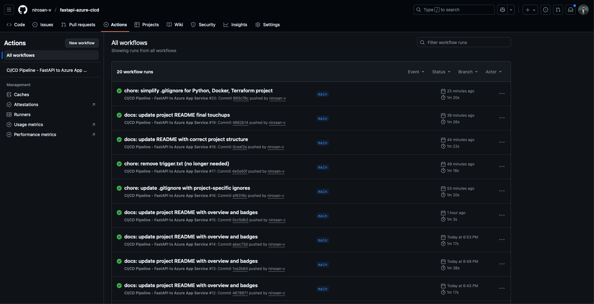
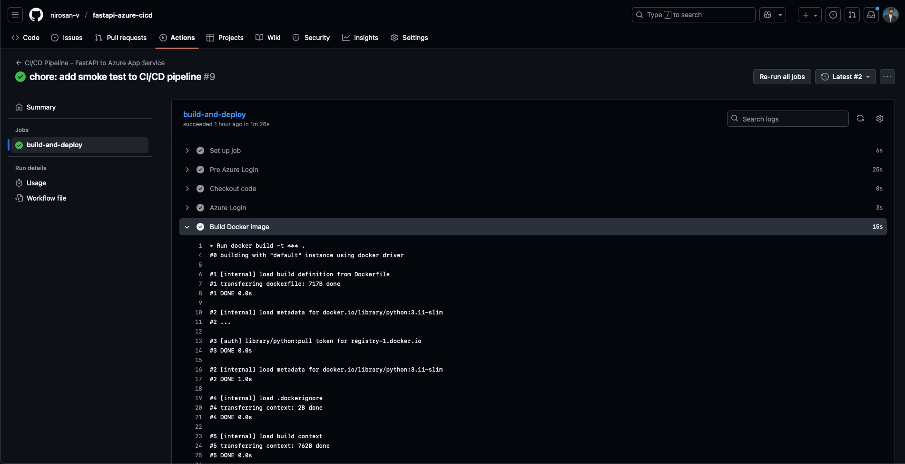
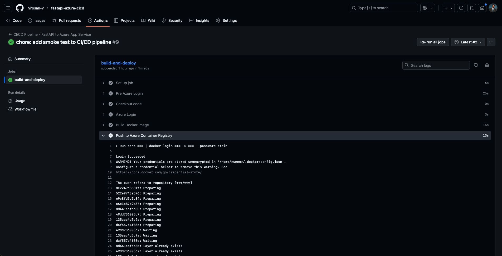
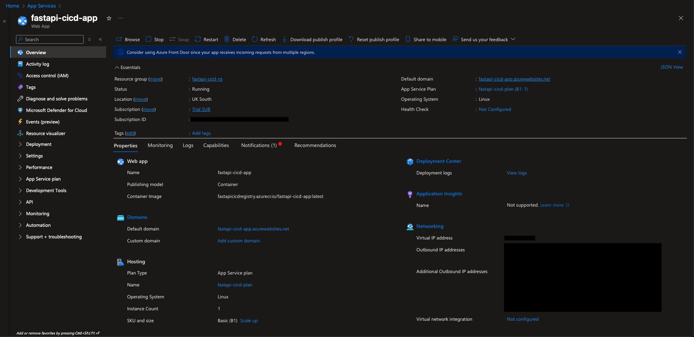
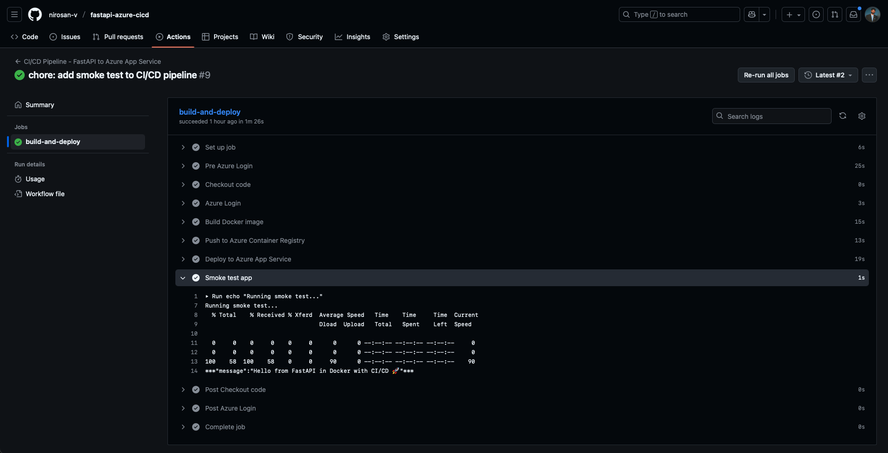
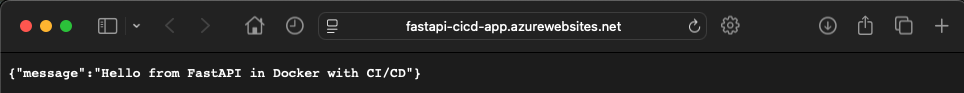
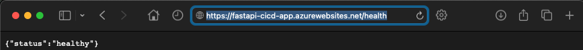

# Deployment Proof - CI/CD Pipeline to Azure App Service

This walkthrough shows the full lifecycle: **commit → GitHub Actions → Docker build → push to ACR → Azure App Service → smoke test → live app**.  

The goal is to demonstrate end-to-end CI/CD using **GitHub Actions, Docker, Azure Container Registry (ACR) and Azure App Service**.

> Sensitive details (subscription ID, IP addresses) are blurred or redacted.

---

## 1) GitHub Actions Trigger
A commit to the `main` branch automatically triggers the GitHub Actions workflow.  

## 2) Docker Build
The workflow builds a Docker image from the FastAPI project using the provided Dockerfile.  

## 3) Push to Azure Container Registry
The built image is tagged and pushed to the Azure Container Registry (ACR).  

---

## 4) Azure App Service Deployment
The workflow deploys the containerised application to Azure App Service.  

## 5) Smoke Test
A smoke test is executed against the `/` endpoint to confirm the app is healthy and responding correctly.  

## 6) Live App Running
The FastAPI app is live and serving requests at the default domain.  

## 7) Health Endpoint
The `/health` endpoint confirms the application is running in a healthy state.  

---

## ✅ Summary
This deployment demonstrated how GitHub Actions can be used to implement a full CI/CD pipeline to Azure App Service in minutes.  

--> Key steps included: triggering a workflow on commit, building a Docker image, pushing it to Azure Container Registry, deploying to App Service, running a smoke test and verifying the live application.  

Continuous Integration and Deployment ensures changes are delivered quickly, consistently and reliably compared to manual release processes.

